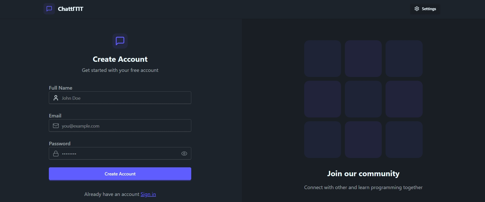
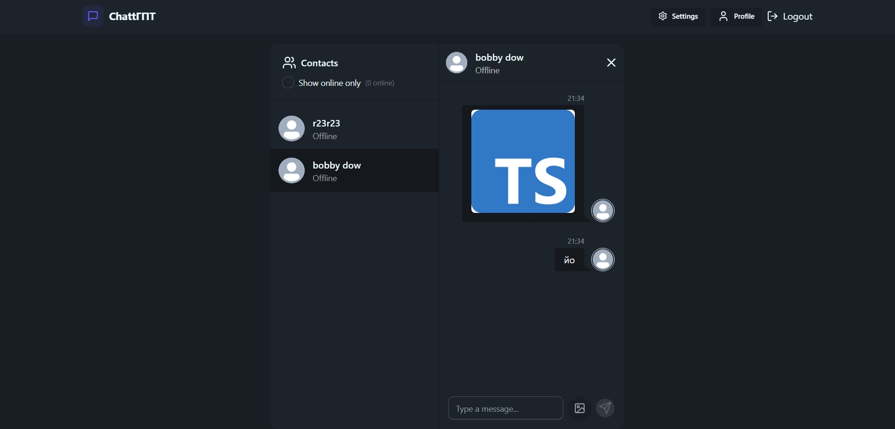

💬 Real-Time Chat App

Полнофункциональное веб-приложение для мгновенного обмена сообщениями. Построено на архитектуре клиент-сервер с использованием веб-сокетов для обеспечения real-time взаимодействия.

🚀 Функционал
Real-time Messaging: Мгновенная отправка и получение сообщений через Socket.io.
User Authentication: Регистрация и авторизация пользователей на базе JWT и Bcrypt.
Online Status: Отслеживание статуса пользователей в реальном времени.
Media Support: Загрузка и хранение аватаров пользователей с интеграцией Cloudinary.
Interface Themes: Система смены визуальных тем оформления.
Secure API: Защита маршрутов и работа с HttpOnly Cookies.

🛠 Технологический стек
Frontend
Core: React 18, Vite
State Management: Zustand
Styling: Tailwind CSS 4.0, DaisyUI
Real-time: Socket.io-client
Routing: React Router DOM 7
Icons: Lucide React

Backend
Server: Node.js, Express
Database: MongoDB, Mongoose
Security: JSON Web Token (JWT), Cookie-parser
Real-time: Socket.io
File Storage: Cloudinary SDK

📦 Установка и запуск
Настройка Backend
Перейдите в директорию backend:
bash
cd backend

Установите зависимости:
bash
npm install

Создайте файл .env в корне папки backend со следующими переменными:
env
MONGODB*URI=ваш_url_mongodb
JWT_SECRET=ваш*секретный*ключ
CLOUDINARY_CLOUD_NAME=имя*облака
CLOUDINARY_API_KEY=ваш_api_key
CLOUDINARY_API_SECRET=ваш_api_secret
PORT=5001

Запустите сервер:
bash
npm run dev

Настройка Frontend
Перейдите в директорию frontend:
bash
cd ../frontend

Установите зависимости:
bash
npm install

Запустите клиент:
bash
npm run dev

## Скриншоты приложения

